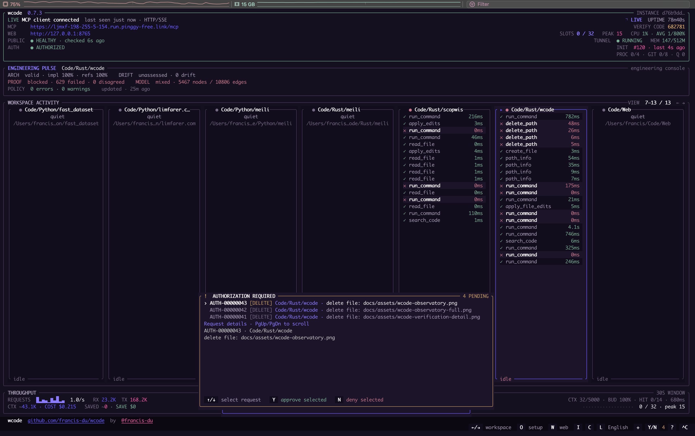
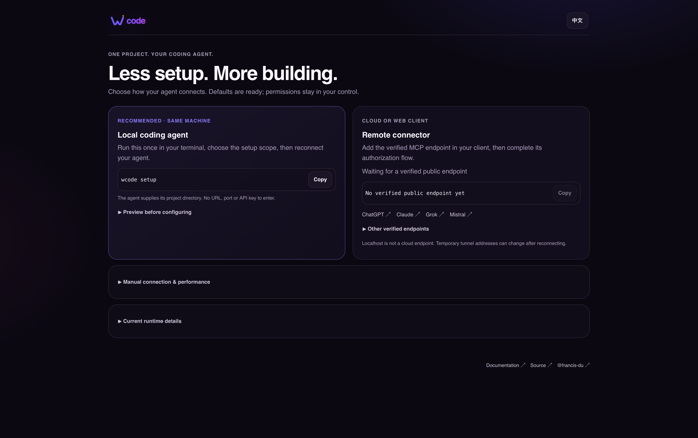

<p align="center">
  
</p>

<p align="center">
  <a href="https://github.com/francis-du/wcode/actions/workflows/release.yml"></a>
  <a href="https://github.com/francis-du/wcode/releases"></a>
  <a href="LICENSE"></a>
  <a href="https://francis-du.github.io/wcode/"></a>
</p>

<p align="center">
  
  
  
</p>

---

<p align="center">
  <strong>A lightweight Code Agent plugin for the AI client you already use.</strong>
</p>

<p align="center">
  Connect Grok, Claude, ChatGPT, Mistral, coding agents, and self-hosted AI clients to your local repository through one authenticated Remote MCP endpoint.
</p>

`wcode` is a small native bridge, not another agent runtime. It gives an existing AI client a focused set of workspace-scoped coding tools: code search, symbol navigation, bounded reads and edits, project context, Git-aware review, and verification. OAuth, a public HTTPS tunnel, a setup page, and a live terminal monitor are enabled automatically.

**One binary · one MCP URL · one setup page · many AI clients.**

<p align="center">
  <a href="https://francis-du.github.io/wcode/"><strong>Website & User Docs</strong></a>
  ·
  <a href="https://github.com/francis-du/wcode/releases"><strong>Releases</strong></a>
  ·
  <a href="DEVELOPMENT.md"><strong>Development</strong></a>
</p>

<p align="center">
  
</p>

<p align="center"><sub>Live terminal dashboard — local health, public tunnel readiness, OAuth pairing, MCP activity, and workspace tasks in one view.</sub></p>

<p align="center">
  
</p>

<p align="center"><sub>Setup Hub — choose an AI client and connect it with the shared Remote MCP URL.</sub></p>

---

## Why wcode

Most AI coding products already have a capable model and agent loop. `wcode` adds the missing local-code bridge without replacing the product you chose.

| | |
| --- | --- |
| **Lightweight** | One Rust binary. No database, daemon stack, browser extension, or separate agent service. |
| **Zero-config by default** | Starts the local server, HTTPS tunnel, OAuth, setup hub, and TUI automatically. |
| **Client-neutral** | The same `/mcp` endpoint works across supported AI chats, coding agents, and self-hosted clients. |
| **Code-aware** | Tree-sitter symbol navigation, bulk search/read tools, project context, review, and verification. |
| **Workspace-scoped** | Models see only explicitly configured repository roots, not your whole machine. |
| **Observable** | Real queued/running/completed tool activity is visible in the terminal dashboard. |

```text
AI client
   │
   │  Remote MCP + OAuth
   ▼
┌───────────────────────────────┐
│             wcode             │
│ search · symbols · edit · git │
│ context · review · verify     │
└───────────────────────────────┘
   │
   ▼
configured workspace roots only
```

Runs on macOS, Linux, and Windows.

---

## Install

**macOS / Linux**

```bash
curl -fsSL https://raw.githubusercontent.com/francis-du/wcode/main/install.sh | sh
```

**Windows PowerShell**

```powershell
irm https://raw.githubusercontent.com/francis-du/wcode/main/install.ps1 | iex
```

Or build it directly with Cargo:

```bash
cargo install --path .
```

## Start

```bash
wcode --workspace "$PWD"
```

That is the normal setup. `wcode` automatically starts the local MCP server, an HTTPS tunnel, OAuth, the terminal dashboard, and a client-neutral Setup Hub. The browser opens one page where you choose your AI client and reuse the same `/mcp` endpoint.

The runtime keeps the machine out of idle system sleep while it is serving, without preventing the display from sleeping or the screen from locking. Pass `--allow-sleep` to opt out. Manual sleep and laptop-lid sleep remain operating-system decisions.

The public endpoint is supervised. If `cloudflared` exits or the public health check fails three consecutive times, wcode shuts down the complete runtime cleanly and starts it again with the original arguments. A restarted Quick Tunnel can receive a new temporary URL, so use the new MCP URL shown by the refreshed TUI and reconnect the client. For an endpoint that survives restarts, pass a stable reverse-proxy URL with `--public-url`.

From another terminal, the running instance can be controlled without finding or killing processes manually:

```bash
wcode restart
wcode stop
```

These requests use a random local control token stored in a per-user runtime file. Restart restores the terminal/TUI state, stops the server and owned tunnel, and then launches the complete original command again; stop performs the same cleanup without relaunching it.

Need more than one repository root?

```bash
wcode \
  --workspace ~/Code/backend \
  --workspace ~/Code/frontend
```

The everyday CLI stays intentionally small. Common overrides are `--public-url`, `--read-only`, `--no-exec`, `--no-open`, `--no-monitor`, and `--allow-sleep`; advanced trust and scheduler controls are kept out of the default help surface.

---

## Supported AI clients

`wcode` speaks standards-based Remote MCP, so platform support is not tied to one model vendor.

| AI client / surface | wcode path |
| --- | --- |
| **Grok** | Custom Remote MCP connector |
| **Claude** | Custom Remote MCP connector |
| **ChatGPT** | Custom MCP app / developer mode where available |
| **Mistral Vibe Work** | Custom MCP Connector |
| **Qoder / Qoder CLI** | Remote HTTP MCP |
| **Kiro** | Remote MCP with OAuth |
| **OpenCode** | Remote MCP with OAuth |
| **Kimi Code CLI** | HTTP MCP + OAuth |
| **Gemini CLI** | Remote MCP |
| **Cursor** | Remote MCP |
| **Windsurf** | Streamable HTTP MCP |
| **VS Code** | MCP client support |
| **LM Studio** | Remote MCP |
| **Open WebUI** | Remote MCP |
| **LibreChat** | Remote MCP |
| **Cherry Studio** | Remote MCP |
| **Dify** | Remote MCP / agent integration |
| **Roo Code / Cline** | MCP client integration |
| **TRAE** | Remote MCP transport |
| **Coze / 扣子** | MCP plugin integration |
| **腾讯元器 / 腾讯云智能体** | Custom MCP transport |
| **阿里云百炼** | Custom MCP transport |
| **Qwen Code** | Remote MCP client |

Platform capabilities, authentication details, free/paid availability, quota behavior, and primary-source evidence change over time. The maintained compatibility matrix lives on the website:

**→ https://francis-du.github.io/wcode/#clients**

`wcode` does not bypass provider billing or plan limits. Model calls remain subject to the AI client's own subscription, Credits, token/message limits, rate limits, or BYOK provider billing.

---

## Fast without being noisy

Independent reads and discovery can run in parallel, while dependent edits stay sequential and hash-guarded. Bulk tools reduce MCP round trips, and the scheduler keeps concurrency bounded instead of blindly filling every available slot.

## Live, local feedback

An interactive terminal gets a compact dashboard automatically: connection state, MCP URL, pairing code, workspace activity, running tools, queue pressure, and throughput. Press `O` to reopen the Setup Hub.

```text
╭ WC  wcode ─────────────────────────────────────────────╮
│ ● MCP client connected     https://…/mcp              │
│ SLOTS 3 / 64 · VERIFY CODE 381204 · LIVE              │
╰────────────────────────────────────────────────────────╯
```

Use `--no-monitor` when you want plain logs.

## Code-aware, not file-dump-first

The agent gets project context, Tree-sitter symbol navigation, exact search, bounded reads, Git-aware change review, and project-native verification. This lets capable models navigate a repository precisely before requesting broad context.

Supported syntax indexing includes Rust, Go, Python, JavaScript/TypeScript, Java, C/C++, C#, Swift, Ruby, PHP, HTML/CSS, Bash, and more.

## What your AI gets

A compact toolbox instead of a remote shell:

`search · symbols · read · edit · project context · Git review · verification · constrained commands`

Writes are atomic and hash-guarded, there is no delete tool, and the model can only address configured workspace roots.

## One setup page

Starting `wcode` opens a client-neutral Setup Hub. It shows the shared MCP URL and links to Grok, Claude, ChatGPT, Mistral, plus the full compatibility guide. There are no provider-specific wcode startup commands.

## Standards-first

`wcode` uses Remote MCP over HTTPS with OAuth 2.1/PKCE and keeps compatibility with modern and established MCP clients. It does not depend on a model vendor API or a vendor-specific agent protocol.

## Public endpoint, automatically

Cloud-hosted AI clients cannot reach localhost, so `wcode` creates a temporary HTTPS endpoint with Cloudflare Quick Tunnel by default. If you already have a stable reverse proxy, pass `--public-url https://…` instead.

The TUI and `/healthz` keep tunnel, OAuth, MCP connectivity, and task status observable when something goes wrong.

Each process has an independent instance ID, local port, OAuth state, health monitor, and `cloudflared` child. Startup waits until the public health response matches that instance before presenting its MCP URL, so multiple `wcode --port …` processes can run without sharing readiness state.

---

## Security

The default policy is narrow on purpose:

- only configured workspace roots are visible;
- common credentials, VCS internals, path traversal, and symlink escapes are blocked;
- edits are bounded, atomic, and SHA-256 guarded;
- no delete tool is exposed;
- commands run without a shell and broad repository-controlled execution requires explicit trust;
- OAuth uses PKCE, constrained redirects, resource-bound tokens, and rotating refresh tokens.

See the full [Security Model](https://francis-du.github.io/wcode/#security) and [DEVELOPMENT.md](DEVELOPMENT.md) for implementation details.

---

<p align="center">
  Keep the code local. Choose the AI client yourself.
</p>
