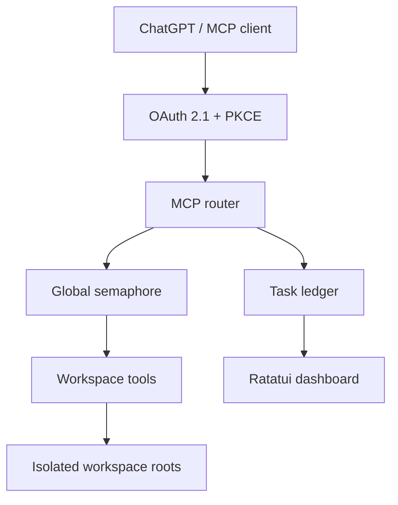

# wcode

[](https://github.com/francis-du/wcode/actions/workflows/release.yml)
[](https://github.com/francis-du/wcode/releases)
[](LICENSE)

`wcode` is a lightweight, authenticated MCP bridge that lets ChatGPT work directly with local codebases through workspace-scoped coding tools.

It runs as a single native binary and exposes only the workspace roots you explicitly configure. Built-in OAuth 2.1 + PKCE, bounded tool concurrency, project-aware verification, Tree-sitter code navigation, and a live terminal dashboard make it suitable for real coding workflows without requiring a database or separate web service. By default, `wcode` can also create a temporary HTTPS endpoint with Cloudflare Quick Tunnel so it can be connected to ChatGPT with minimal setup.

## Design

The project keeps the model-facing protocol, concurrency control, and filesystem boundary separate:



The main ideas are:

- Each configured directory is an independent workspace boundary.
- Calls enter a real `queued → running → completed/failed` lifecycle around the global tool semaphore.
- Independent requests and batch items can run concurrently; dependent edits still use SHA-256 preconditions and per-file locks.
- A positive coding harness detects project types, reads bounded repository guidance, caches the resulting context, and infers quick/full quality gates.
- A lazy Tree-sitter index keeps bounded in-memory ASTs and returns exact symbol ranges, qualified names, and syntax-level context across common languages.
- Filesystem work stays outside Tokio's async executor, while bulk tools reduce MCP round trips.
- Secrets and noisy local files are filtered before workspace content is returned.
- The live dashboard is observability only: it reads the same in-memory task ledger used by the MCP scheduler and never simulates activity.
- `wcode` remains a single native binary with no database or web frontend.

Supported platforms: macOS, Linux, and Windows Terminal / PowerShell.

## Install

### macOS / Linux

```bash
curl -fsSL https://raw.githubusercontent.com/francis-du/wcode/main/install.sh | sh
```

### Windows PowerShell

```powershell
irm https://raw.githubusercontent.com/francis-du/wcode/main/install.ps1 | iex
```

The installer downloads the latest GitHub Release for your platform, verifies it against `SHA256SUMS`, and installs `wcode` into `~/.local/bin` by default. Set `WCODE_INSTALL_DIR` to choose another directory.

To build from source instead:

```bash
cargo install --path .
```

Release archives are available from the GitHub Releases page. Ordinary pushes and pull requests run formatting, locked checks, Clippy, and tests across Linux, macOS, and Windows; optimized CLI packages are built only for `v*` release tags.

## Start

Expose the current directory:

```bash
wcode --workspace "$PWD"
```

Expose multiple workspaces:

```bash
wcode \
  --workspace ~/Code/backend \
  --workspace ~/Code/frontend \
  --workspace ~/Code/shared

# Optional override for a large, high-core machine
wcode --workspace ~/Code/monorepo --max-parallel-tools 96
```

Workspace IDs are derived from directory names. The first workspace is the default. Every file and command tool accepts an optional `workspace` ID; use `workspace_info` to discover them.

Useful modes:

```bash
# Local protocol testing without a public tunnel
wcode --workspace "$PWD" --no-tunnel

# Use an existing HTTPS reverse proxy
wcode --workspace "$PWD" --public-url https://wcode.example.com

# Disable writes and command execution
wcode --workspace "$PWD" --read-only --no-exec

# Do not automatically open ChatGPT's Connector setup page
wcode --workspace "$PWD" --no-install-chatgpt

# Trusted repository: permit broader builds, tests, interpreters, and package scripts
wcode --workspace "$PWD" --allow-risky-exec

# Intentional large truncation or near-empty replacement
wcode --workspace "$PWD" --allow-destructive-writes

# Override the TUI estimate with the input price of the model you use
wcode --workspace "$PWD" --input-token-price-per-million-usd 10
```

Nested/overlapping workspace roots, filesystem roots, and the current user's home directory are rejected by default. The exceptional flags `--allow-overlapping-workspaces` and `--allow-broad-workspace` should only be used when the broader trust boundary is intentional.

Inside a selected workspace, `list_files` exposes regular files from source, build, dependency, IDE, and log directories instead of silently filtering them as noise. Protected credential files, repository-control internals, wcode temporary paths, symlink aliases, absolute paths, and parent traversal remain blocked. The result limit defaults to 2,000 entries and can be raised to 10,000.

Direct `run_command` calls allow the exact read/check shapes `cargo fmt --check`, `cargo check`, and `cargo check --locked` without `--allow-risky-exec`. Broader Cargo arguments, tests, builds, package scripts, compilers, and interpreters still require the explicit flag. `cargo check` may execute repository build scripts or procedural macros, so the selected workspace should still be code you trust; wcode's command policy is not an operating-system sandbox.

## Concurrency and fan-out

Without an override, `wcode` chooses an adaptive global cap equal to **8× the available logical CPUs, clamped to 64–128 slots**. This gives large repositories substantially more headroom for independent reads and discovery without making concurrency unbounded. `--max-parallel-tools` can explicitly raise the cap up to 256.

The value is a **global safety cap**, not a target that every request tries to fill. One ordinary MCP `tools/call` consumes one slot, so a sequential client may correctly show `Slots 1 / 64`; `parallel_tools`, `review_changes`, JSON-RPC batches, and phased verification are the paths that can occupy several slots.

`wcode` can use multiple slots when work is genuinely independent:

- JSON-RPC batch items are scheduled concurrently.
- `parallel_tools` fans out 2–128 independent read/discovery operations. Each child acquires its own slot, keeps its own result, and appears as a separate TUI task.
- `review_changes` runs its bounded Git probes concurrently.
- `verify_project` runs independent checks concurrently inside a phase, then places barriers before test/Clippy/build phases to avoid compiler-cache contention.

Use `read_files` or `search_many` instead when one bulk traversal is cheaper than several separate calls. Those bulk tools count as one MCP task/slot even though their filesystem implementation may use internal CPU parallelism. `parallel_tools` intentionally rejects writes: reads that depend on previous results and all dependent edits remain sequential.

A model-facing fan-out request has this shape:

```json
{
  "tasks": [
    {"id": "implementation", "tool": "read_file", "arguments": {"path": "src/main.rs"}},
    {"id": "tests", "tool": "read_file", "arguments": {"path": "tests/main.rs"}},
    {"id": "symbols", "tool": "search_many", "arguments": {"queries": ["TaskMonitor", "ToolHarness"]}}
  ]
}
```

The dashboard reports `Slots active / cap` and `Peak`, the highest real number of simultaneously running child tasks observed in this process.

## Live Dashboard

When stdout is an interactive terminal, `wcode` starts a cross-platform single-screen dashboard automatically.

```text
╭ WC  wcode 0.1.0 ─────────────────────────────────────────────────────╮
│ ● ChatGPT connected  last seen 2s ago · Chat mode   ⠹ LIVE  04m18s │
│ MCP  https://example.trycloudflare.com/mcp   SLOTS 6/64 · VERIFY CODE 381204│
╰───────────────────────────────────────────────────────────────────────╯
╭ OVERVIEW ─────────────────────────────────────── 30S  2.4 req/s ─────╮
│  6 ACTIVE   2 QUEUED   142 COMPLETED   1 FAILED                     │
│  TOKEN ECONOMY · TOTAL   ~420K saved   CTX $0.85 · SAVE $2.10       │
╰───────────────────────────────────────────────────────────────────────╯
╭ WORKSPACE ACTIVITY ───────────────────────────────── VIEW 1–3 / 6 ───╮
│ ╭ ▸ ● backend ─╮ ╭   ● frontend ─╮ ╭   ● shared ────────────────╮  │
│ │ ⠹ search_many│ │ ⠹ read_files │ │ ✓ workspace_info           │  │
│ │ ◌ run_command│ │ ✓ search_code│ │ quiet                       │  │
│ ╰ 2 run · 1 wait╯ ╰ 1 run ──────╯ ╰ idle ───────────── DEFAULT ─╯  │
╰───────────────────────────────────────────────────────────────────────╯
╭ THROUGHPUT ──────────────────────────────────────── 30S WINDOW ──────╮
│ REQUESTS ▁▂▃▅▇▆▄▂  2.4/s  RX 124K  TX 680K    ━━······ 6/64 · peak 12│
│ 30S CTX ~170K · COST $0.21   SAVED ~42K · SAVE $0.21               │
╰───────────────────────────────────────────────────────────────────────╯
  wcode  github.com/francis-du/wcode  by @francis-du    O setup  ? help
```

The dashboard uses a dark, high-contrast card hierarchy with rounded panels, focused Workspace borders, status-aware activity rows, a real slot-utilization bar, and keycap-style shortcuts. Project/Author plus the wide-footer Setup shortcut are mouse-clickable, and Project/Author/Setup links in Help are clickable too; `G`, `A`, and `O` remain keyboard fallbacks. The heartbeat and running-task elapsed time refresh every 150 ms while work is queued or running, then fall back to a 500 ms idle cadence to reduce terminal CPU use. Terminal resize is handled automatically; narrow layouts collapse metric cards and links without crushing Workspace content, and very small terminals show a safe fallback.

Metrics:

- `queued` — waiting for a global tool permit.
- `active` — currently executing child tasks.
- `Slots active / cap` — real semaphore occupancy versus `--max-parallel-tools`; the cap is not an automatic target.
- `Peak` — the process high-water mark for simultaneously running child tasks.
- `done` / `failed` — terminal task outcomes for this process.
- `RX` / `TX` — approximate tool argument and result bytes.
- `TOKEN ECONOMY · TOTAL` — process-lifetime accumulated estimate. `CTX $N` estimates the input-token equivalent of MCP tool output; `SAVE $N` accumulates measurable context avoided by precision tools.
- `CTX ~N` / `SAVED ~N` — estimated context tokens represented or avoided, using a transparent approximation of four serialized bytes per token. In Throughput these values are the rolling 30-second window.
- Dollar values use `--input-token-price-per-million-usd` (default `$5/M`). Very small positive amounts keep micro-dollar precision instead of rounding to a misleading `$0.0000`; all values remain estimates, not billing data.
- Workspace activity — one column per visible workspace, ordered as running → queued → recent completed/failed. The number of rows follows the terminal's remaining height, and the number of columns follows its width.
- Throughput — a lightweight rolling request, byte, token, and estimated-savings window.

Token and dollar values are estimates, not an OpenAI billing record. Tokenization varies by model and content; only measurable source context omitted by the syntax-aware tools is counted as saved, so ordinary reads and searches do not manufacture savings.

The UI uses an alternate screen and restores the terminal, raw mode, and cursor on normal shutdown or Ctrl-C. It never appends dashboard frames to scrollback.

Disable the dashboard for plain logs:

```bash
wcode --no-monitor
```

A non-interactive stdout (CI, redirect, or pipe) automatically uses plain output. For debug tracing, disable the monitor so logs remain readable:

```bash
RUST_LOG=wcode=debug wcode --no-monitor
```

## Quality harness

The Harness now helps the model make better changes instead of only limiting concurrency:

- `project_context` detects Rust, Node, Python, Go, and Make projects; returns bounded excerpts from `AGENTS.md`, Copilot instructions, `CLAUDE.md`, contributing/development notes, and README; and caches the profile until those files change.
- `review_changes` runs bounded Git probes in parallel and summarizes staged, unstaged, and untracked files, line counts, file categories, whitespace/conflict-marker failures, test-change signals, risk level, and the recommended verification level without returning the diff body.
- It infers repository-native checks from manifests, lockfiles, package scripts, and Make targets. Examples include `git diff --check`, `cargo fmt --check`, `cargo check --locked`, package lint/typecheck scripts, `pytest`, and `go test ./...`.
- `verify_project` runs either a fast `quick` gate or a broader `full` gate. Independent checks run in bounded phases, while compiler-heavy test, Clippy, and build work stays sequenced to reduce cache contention.
- `parallel_tools` fans out 2–128 already-known independent read/discovery calls while preserving a real semaphore slot, result, and TUI task for every child.
- MCP initialization guides the model through `project_context → edit → review_changes → verify_project`, then requires it to report checks, residual failures, and unverified assumptions.

The quality tools preserve the same workspace, command allowlist, timeout, environment scrubbing, and monitor lifecycle boundaries as ordinary tool calls. Model-facing `run_command` accepts tightly constrained Git/ripgrep inspection plus the exact default Cargo verification shapes `cargo fmt --check`, `cargo check`, and `cargo check --locked`; path-redirection options remain blocked. `verify_project` additionally has a narrow internal verification lane for broader exact Harness-inferred shapes, so Cargo test/Clippy/build, `go test ./...`, `pytest -q`, and recognized lint/typecheck/test/build scripts can run without the global risky flag. `cargo check` can still execute project-controlled build scripts or procedural macros, so the configured repository must be trusted; this is not an operating-system sandbox.

## Syntax-aware code index

`wcode` embeds Tree-sitter grammars for Bash, C, C++, C#, CSS, Dart, Elixir, Go, HTML, Java, JavaScript, Lua, OCaml, OCaml interfaces, PHP, Python, R, Ruby, Rust, Swift, TypeScript, and TSX. Common extensionless script entry points such as `Rakefile`, `Gemfile`, `.bashrc`, and `.zshrc` are recognized as well.

HTML outlines intentionally keep navigation signal high: elements with an `id` and custom-element/component tags are indexed, while ordinary structural tags are omitted. CSS outlines expose selector lists, custom properties, and `@keyframes` blocks. Embedded JavaScript or CSS inside HTML remains syntax-level HTML content; use the corresponding standalone source file for language-specific symbols.

The index is lazy: files are parsed only when `file_outline`, `find_symbol`, or `symbol_context` needs them. Lightweight symbol records stay indexed while complete source trees use a 128-file in-memory LRU-style cache. File metadata invalidates externally changed entries, SHA-256 identifies the parsed content, and successful MCP writes invalidate the affected entry immediately.

- `file_outline` returns definitions, qualified names, redacted signatures, exact source ranges, parse-error state, total/returned symbol counts, and cache statistics for one file.
- `find_symbol` searches a file or directory in parallel and returns opaque symbol IDs for the current indexed revision. Qualified queries such as `Service::run` or `Worker.execute` use the leaf name for source prefiltering, so they do not require the qualified spelling to appear literally in the file. Re-run the query after editing the symbol's file.
- `symbol_context` expands one symbol into a bounded body, nested definitions, syntax-level calls, and same-file call targets.

The provider and every result are marked `tree-sitter` / `syntax`. This deliberately does not claim compiler-level type resolution, overload selection, macro expansion, or dynamic-dispatch accuracy; a future LSP/SCIP provider can add those capabilities without changing the MCP result model.

## MCP tools

- `workspace_info` — list workspace IDs, roots, and capabilities.
- `project_context` — return cached repository guidance, detected project types, manifests, and recommended checks.
- `review_changes` — review the bounded Git working-tree summary and recommend a verification level.
- `parallel_tools` — run independent read/discovery operations concurrently without hiding child results or monitor activity.
- `verify_project` — execute the inferred quick or full phased quality gate with bounded diagnostic output.
- `list_files` — recursively list regular files inside the selected workspace, including build, dependency, IDE, and log files while omitting protected credential/VCS/internal paths and symlink aliases.
- `search_code` / `search_many` — exact substring search.
- `file_outline` — parse one supported file into a bounded syntax-level symbol outline.
- `find_symbol` — search definitions and qualified names through the lazy multi-language index.
- `symbol_context` — retrieve bounded source and syntax relationships for a returned symbol ID.
- `read_file` / `read_files` — bounded UTF-8 reads with edit hashes.
- `replace_text` — atomic exact replacement with a SHA-256 precondition.
- `create_file` — atomic creation without overwrite.
- `run_command` — run an allowlisted program directly, without a shell.

## Connect ChatGPT

1. Start `wcode` and keep the terminal open.
2. In ChatGPT, open Settings → Connectors and enable Developer mode.
3. Create a Connector. `wcode` opens the current setup deep-link automatically unless `--no-install-chatgpt` is used:
   `https://chatgpt.com/plugins#settings/Connectors?create-connector=true&redirectAfter=%2Fplugins`
4. Paste the MCP URL shown by `wcode`.
5. Choose OAuth and enter the six-digit pairing code on the authorization page.
6. Use the Connector from Chat mode. When ChatGPT sends MCP `initialize`, the large Setup panel collapses automatically.

Inside the dashboard, press `O` to reopen Connector setup, `G` for the project repository, `A` for the author profile, `?` for Help & Links, `←` / `→` to move between workspaces, and `Shift` + `←` / `→` to move a full workspace page. On terminals that support Crossterm mouse events, the underlined Project/Author footer text and the Project/Author/Setup rows in Help can also be clicked directly.

## Connection diagnostics

Connection state is layered instead of collapsing every problem into “disconnected”: local server → public URL reachability/tunnel process → OAuth registration/authorization → MCP requests → ChatGPT initialize/last-seen. `/healthz` exposes the same public-URL, tunnel, initialize-count, and last-seen state used by the TUI. A Quick Tunnel that exits updates the dashboard immediately, but the local MCP server keeps running so the failure is diagnosable rather than terminating the process.

For Quick Tunnels and explicit `--public-url` endpoints, `wcode` directly runs system `curl` against the unauthenticated `/healthz` endpoint every 25 seconds with a short timeout. One failure is tolerated; three consecutive failures mark the public URL unavailable, and the next success clears the streak. This is separate from the cloudflared child-process check, so the dashboard can distinguish a dead process from a live tunnel process whose public URL is unreachable. An unauthenticated `/mcp` request is still expected to return `401` with `WWW-Authenticate`; that is a healthy protected MCP endpoint, not evidence that the server is down.

## cloudflared

By default, `wcode` starts a Cloudflare Quick Tunnel. A Quick Tunnel is a temporary public URL and may change after restart; use `--public-url` with a fixed reverse proxy or named tunnel when the Connector URL must stay stable. The cloudflared child is polled independently while the MCP server runs, and public reachability is checked separately through `/healthz`. If a Quick Tunnel becomes unavailable, restart `wcode` to obtain a new tunnel URL and then update the ChatGPT Connector URL; restarting alone leaves ChatGPT pointing at the old address.

- macOS: detects Homebrew and can run `brew install cloudflared`.
- Windows: detects winget and can install `Cloudflare.cloudflared`; otherwise it prints the official binary fallback.
- Linux: detects apt, dnf, yum, or pacman and prints the relevant official repository guidance. It does not guess at distro-specific repository setup.
- `--no-install` prevents automatic installation.
- `--public-url` and `--no-tunnel` avoid the dependency entirely. An explicit public URL must be HTTPS, except loopback HTTP is allowed for local testing; user information, query strings, and fragments are rejected.

## Security

The default policy is deliberately restrictive:

- No delete tool is exposed. Exact replacement and create-new are the only MCP write primitives.
- Filesystem roots and the current user's home directory are rejected as overly broad workspaces unless `--allow-broad-workspace` is explicit.
- Parent/child and nested workspace roots are rejected unless `--allow-overlapping-workspaces` is explicit, preventing one workspace from silently inheriting another workspace's files.
- Absolute paths, `..` traversal, changed workspace roots, symlink components, and on Unix hard-linked write targets are rejected. Unix builds also pin the workspace root’s device/inode identity, so replacing a configured root with a different directory at the same path fails closed.
- VCS metadata and common credential locations such as `.git`, `.env`, `.ssh`, cloud credential directories, `.npmrc`, `.pypirc`, and private-key filenames cannot be addressed by MCP reads, writes, indexing, or command path arguments. Template files such as `.env.example` remain directly readable.
- Writes are bounded to 4 MiB, use SHA-256 preconditions and per-file locks, preserve existing permissions, fsync temporary content, and create new files without overwrite. Emptying a file or removing at least 60% and 4 KiB is blocked unless `--allow-destructive-writes` is explicit.
- Model-facing `run_command` keeps a bounded default lane: tightly constrained Git/ripgrep inspection plus the exact shapes `cargo fmt --check`, `cargo check`, and `cargo check --locked`. Cargo redirection options, arbitrary arguments, metadata, test, Clippy, build, package-manager scripts, interpreters, and compilers still require `--allow-risky-exec`; `verify_project` may run only its broader exact Harness-inferred quality shapes. The selected cwd and every explicit path remain workspace-scoped, but Cargo project configuration and build scripts are not an OS sandbox, so default Cargo checks should still be used only on a trusted configured repository.
- Commands run without a shell, receive scrubbed credential-related environment variables, stream output through a 256 KiB bound, and are terminated on timeout. Git mutation is blocked; inherited `GIT_*` variables are cleared, repository discovery is capped at the selected workspace, fsmonitor/hooks/external diff/textconv/signature helpers are disabled, and global/system config is ignored. Rust response files plus Cargo/Go/package-manager options that can redirect configuration, execution, or filesystem roots are blocked even when risky execution is enabled.
- OAuth dynamic registration is bounded to 128 clients. Redirect URIs are limited in count/size and must use HTTPS or loopback HTTP without fragments/userinfo. Authorization codes expire after five minutes and are single-use; access tokens are actually enforced at one hour; refresh tokens expire after 30 days and rotate atomically so a used refresh token cannot be replayed.

`--allow-risky-exec` is an explicit trust decision, not an operating-system sandbox. A malicious build script or test runs with the user's OS account and may access resources outside the workspace; use it only for repositories you trust, or run `wcode` inside a stronger container/VM boundary.

Implementation constraints, test commands, and release details are in [DEVELOPMENT.md](DEVELOPMENT.md).

