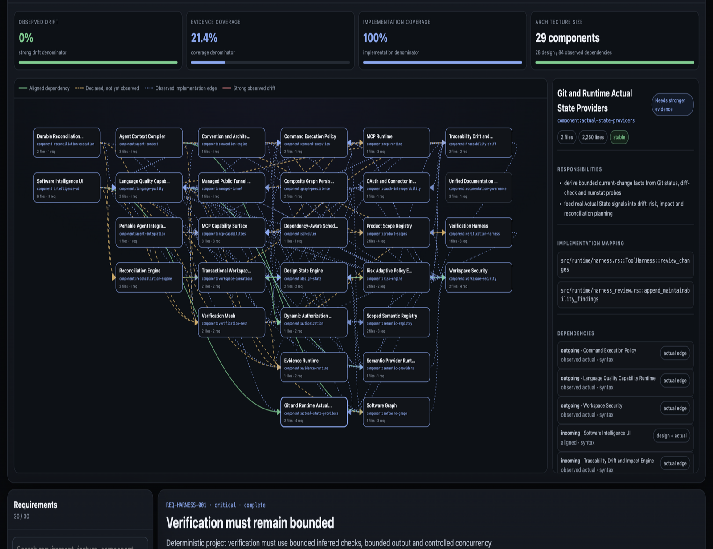
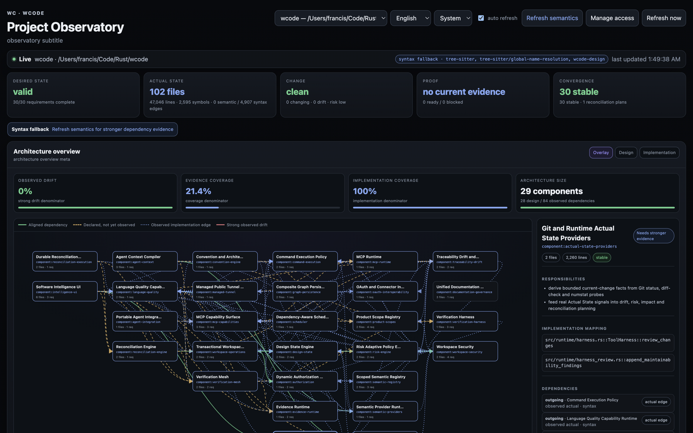
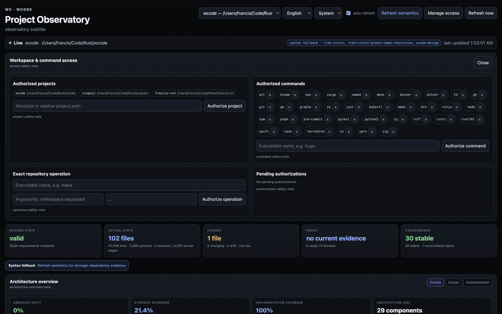
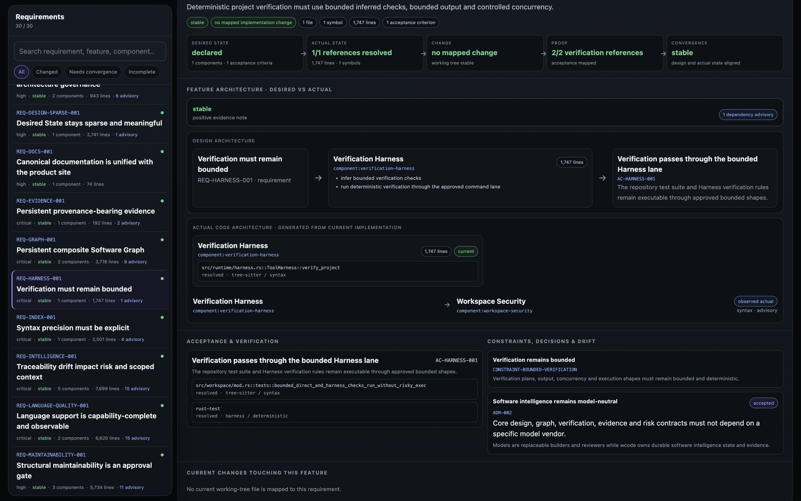

<p align="center">
  
</p>

<p align="center">
  <a href="https://github.com/francis-du/wcode/actions/workflows/release.yml"></a>
  <a href="https://github.com/francis-du/wcode/releases"></a>
  <a href="LICENSE"></a>
  <a href="https://wcode.francis.run/"></a>
</p>

<p align="center">
  
  
  
</p>

---

<p align="center">
  <strong>Software Intelligence Runtime for AI-native development.</strong>
</p>

<p align="center">
  Keep models replaceable. Make software continuously converge toward its intended design — with evidence.
</p>

`wcode` turns **Design State, Software Graph, Traceability, Risk, Verification, Evidence, and Reconciliation** into the durable layer around AI-generated software. Code and Git remain first-class implementation artifacts, but the primary control plane becomes what the software should be, what it actually is, what changed, what is risky, and what evidence proves the result.

Models are execution providers, not the product core. Claude, ChatGPT, Grok, Mistral, coding agents, and future models connect through Remote MCP as replaceable builders/reviewers while wcode owns the local software-intelligence state and security boundary.

**Design State · Software Graph · Verification Mesh · Evidence & Risk · Reconciliation.**

<p align="center">
  <a href="https://wcode.francis.run/"><strong>Website & User Docs</strong></a>
  ·
  <a href="https://github.com/francis-du/wcode/releases"><strong>Releases</strong></a>
  ·
  <a href="docs/manual/software-intelligence.md"><strong>Software Intelligence</strong></a>
  ·
  <a href="docs/manual/software-intelligence.zh-CN.md"><strong>中文</strong></a>
  ·
  <a href="docs/manual/code-agent-integrations.md"><strong>Agent Integrations</strong></a>
  ·
  <a href="docs/manual/product-scopes.md"><strong>Product Scopes</strong></a>
  ·
  <a href="docs/manual/development.md"><strong>Development</strong></a>
</p>

<p align="center">
  
</p>

<p align="center"><sub>Live terminal dashboard — local health, public tunnel readiness, OAuth pairing, MCP activity, and workspace tasks in one view.</sub></p>

<p align="center">
  
</p>

<p align="center"><sub>Browser setup — connect a model executor and inspect the active local runtime.</sub></p>

<p align="center">
  
</p>

<p align="center"><sub>Architecture overview — desired vs actual component dependencies, observed drift, evidence and implementation coverage in one view.</sub></p>

<p align="center">
  
  
  
</p>

<p align="center"><sub>Project Observatory, local authorization, and detailed workspace intelligence.</sub></p>

---

## Why wcode

AI coding is getting better at producing code. The harder problem is keeping a software system aligned with its intended design while models, humans, tests, dependencies, and runtime behavior keep changing. `wcode` is built for that control problem.

| | |
| --- | --- |
| **Design-first** | Structured `.wcode` Design State makes requirements, architecture, constraints, acceptance criteria, and decisions machine-operable desired state. |
| **Software Digital Twin** | Software Graph models files, symbols, relationships, tests, configuration, and progressively richer semantic/runtime facts with explicit provenance. |
| **Traceability & Drift** | Requirement → design → implementation → verification chains expose missing coverage and design/implementation drift. |
| **Risk-adaptive Verification** | Deterministic checks, independent reviewers, disagreement, and real Property/Mutation/Fuzz/Runtime-Canary stage executors scale with risk instead of using one fixed gate. |
| **Evidence-driven** | Verification results retain producer, revision, policy, confidence, and disagreement instead of disappearing into chat history. |
| **Reconciliation-oriented** | The central primitive is convergence from Desired State to Actual State, not just another `edit_file()` loop. |
| **Model-neutral** | Remote MCP is the executor interface. Models can change without changing the durable software-intelligence model. |
| **Local-first security** | Workspace isolation, bounded tools, no-shell execution policy, OAuth, and atomic hash-guarded writes stay underneath every agent. |

```text
Human intent / Design State
            │
            ▼
┌──────────────────────────────────────┐
│     wcode Software Intelligence      │
│                                      │
│ Design State  ↔  Software Graph      │
│      │              │                │
│      └─ Traceability / Drift ─┐      │
│                               ▼      │
│ Impact → Risk → Reconciliation Plan  │
│                 │                    │
│                 ▼                    │
│       Verification → Evidence        │
└────────────────┬─────────────────────┘
                 │ MCP: builders/reviewers
                 ▼
          replaceable AI models
                 │
                 ▼
             Git + Runtime
```

Runs on macOS, Linux, and Windows.

---

## Install

**macOS / Linux**

```bash
curl -fsSL https://raw.githubusercontent.com/francis-du/wcode/main/install.sh | sh
```

**Windows PowerShell**

```powershell
irm https://raw.githubusercontent.com/francis-du/wcode/main/install.ps1 | iex
```

## Start

```bash
wcode --workspace "$PWD"
```

That is the normal setup. `wcode` automatically starts the local MCP server, a managed HTTPS tunnel, OAuth, the terminal dashboard, and a client-neutral Setup Hub. The default `--tunnel-provider auto` policy tries Cloudflare Quick Tunnel first, then falls back to `localhost.run` and Pinggy when startup, URL discovery, or the instance-matched public health check fails. The SSH-based fallbacks require no account; use `--tunnel-provider cloudflare|localhost-run|pinggy` to force one provider. The browser opens one page where you choose your AI client and reuse the same `/mcp` endpoint.

The runtime keeps the machine out of idle system sleep while it is serving, without preventing the display from sleeping or the screen from locking. Pass `--allow-sleep` to opt out. Manual sleep and laptop-lid sleep remain operating-system decisions.

The public endpoint is supervised. A managed tunnel candidate is accepted only after `/healthz` returns the current wcode instance ID; `auto` moves to the next provider when that check fails. If the active tunnel process later exits or the public health check fails three consecutive times, wcode shuts down the complete runtime cleanly and starts it again with the original arguments. Temporary tunnel URLs can change after restart, so use the new MCP URL shown by the refreshed TUI and reconnect the client. For an endpoint that survives restarts, pass a stable reverse-proxy URL with `--public-url`.

From another terminal, the running instance can be controlled without finding or killing processes manually:

```bash
wcode restart
wcode stop
```

These requests use a random local control token stored in a per-user runtime file. Restart restores the terminal/TUI state, stops the server and owned tunnel, and then launches the complete original command again; stop performs the same cleanup without relaunching it.

Need more than one repository root?

```bash
wcode \
  --workspace ~/Code/backend \
  --workspace ~/Code/frontend
```

The everyday CLI stays intentionally small. Common overrides are `--public-url`, `--read-only`, `--no-exec`, `--no-open`, `--no-monitor`, and `--allow-sleep`; advanced trust and scheduler controls are kept out of the default help surface.

---

## Model & agent execution layer

`wcode` uses MCP as the model/executor access layer. Local coding agents can use the new `wcode --workspace <repo> mcp-stdio` transport; cloud/web connectors keep using Streamable HTTP + OAuth. The same Harness, Workspace policy, Tools, Prompts, Resources, 2026 Tasks, Software Intelligence, and Evidence runtime sit behind both transports.

Reusable workflow guidance is available as a small non-executable Agent Skill / Agent Plugin package:

```bash
wcode --workspace "$PWD" agent-plugin --output wcode-agent-plugin
```

The package contains Agent Plugins 1.0 metadata, Claude-compatible metadata, a ZCode marketplace/manifest, and `skills/wcode-software-intelligence/SKILL.md`. It intentionally contains no hooks, scripts, credentials, or implicit MCP Workspace. ZCode's declarative MCP entry uses its explicit `${CLAUDE_PROJECT_DIR}` variable; other clients configure MCP separately.

Start with the unified **[Documentation](https://wcode.francis.run/docs/)**. The
single maintained source for vendor-specific plugin, Skill, MCP, installation,
and diagnostic commands is **[Code Agent Integrations](https://wcode.francis.run/docs/code-agent-integrations/)**. The website's
[client matrix](https://wcode.francis.run/#clients) has a separate,
narrow purpose: remote transport, OAuth, and provider-plan compatibility. It
does not duplicate Code Agent plugin installation instructions.

`wcode` does not bypass provider billing or plan limits. Model calls remain subject to the AI client's own subscription, Credits, token/message limits, rate limits, or BYOK provider billing.

---

## Fast without being noisy

Independent work can fan out, but the scheduler models which workspace paths each child reads, creates, mutates, moves, or deletes before it runs. Overlapping read/write paths and parent/child dependencies are ordered; same-file `apply_edits` children with the same SHA-256 can be coalesced when their ranges do not conflict, while unsafe overlaps are rejected. Bulk tools reduce MCP round trips. The adaptive default concurrency is CPU×12, clamped to 96–192 slots, with a hard Harness maximum of 256.

## Live, local feedback

An interactive terminal gets a compact dashboard automatically: connection state, MCP URL, pairing code, workspace activity, running tools, queue pressure, and throughput. Press `O` to reopen the Setup Hub.

```text
╭ WC  wcode ─────────────────────────────────────────────╮
│ ● MCP client connected     https://…/mcp              │
│ SLOTS 3 / 96 · VERIFY CODE 381204 · LIVE              │
╰────────────────────────────────────────────────────────╯
```

Use `--no-monitor` when you want plain logs.

## Code-aware, not file-dump-first

The agent gets project context, Tree-sitter symbol navigation, exact search, bounded text/media reads, Git-aware change review, and project-native verification. `read_media` is metadata-first and only emits image/audio MCP content when the current client explicitly advertises matching multimodal support; unknown capability fails closed instead of guessing from a model brand. This lets capable models navigate a repository precisely before requesting broad context.

The syntax index supports 22 language modes: Bash, C, C++, C#, CSS, Dart, Elixir, Go, HTML, Java, JavaScript, Lua, OCaml, OCaml Interface, PHP, Python, R, Ruby, Rust, Swift, TypeScript, and TSX. The same canonical surface now feeds the first-party LSP layer and the **Language Quality Matrix**. wcode never collapses this to one “supported” badge: syntax, semantic, format, lint, type/static analysis, test, security, Property, Mutation, Fuzz, and Runtime-Canary coverage are reported separately, including unavailable tools and explicit gaps. See [Language Quality](https://wcode.francis.run/docs/language-quality/).

## Software Intelligence Runtime — available now

Software Intelligence is available through **four first-class surfaces**: model-neutral MCP tools, local `wcode intelligence` / `wcode verification` CLI views, the live TUI (`I` for Intelligence, `W` for the Project Observatory), and the token-protected `/intelligence` Project Observatory. MCP remains the executor interface rather than the product boundary.

Add `.wcode/project.yaml` and `.wcode/design/` when you want design-aware traceability. A connected agent can call `design_init` to bootstrap **sparse** Design State safely: only project/product documents are created initially, while requirements/components/constraints/acceptance/decisions stay absent until there is meaningful desired state to declare. Existing design files are never overwritten. The wcode repository itself already contains a dogfood Design State.

wcode also has one canonical **Product Scope** registry for its own capability boundaries: `runtime`, `integrations`, `workspace`, `design`, `graph`, `semantics`, `traceability`, `risk`, `verification`, `evidence`, `reconciliation`, and `experience`. `workspace_info` and `project_context` expose the registry, every MCP Tool carries `dev.wcode/productScopes` metadata, and clients can read the same model from `wcode://runtime/product-scopes`. `scope_status` applies the registry to the selected repository and reports per-scope source counts plus bounded unmapped supported-source paths. Passing `scopes` to `software_context` narrows source/symbol navigation to recognized product roots; `semantic_query.scopes` filters scoped semantic facts while leaving unscoped facts global. Freeform business/domain scopes remain supported. See [Product Scopes](https://wcode.francis.run/docs/product-scopes/).

Local inspection does not require an MCP client:

```bash
wcode --workspace "$PWD" intelligence
wcode --workspace "$PWD" intelligence --check --json
wcode --workspace "$PWD" verification
wcode --workspace "$PWD" verification --plan-id VP-...
```

`intelligence --check` is the fail-closed repository/release gate: it exits non-zero when Design State is uninitialized/invalid, any Requirement→Component / Design→Implementation / Acceptance→Verification dimension is below 100%, or a required Convention policy reports an error. Product Scope auditing is also a hard gate when the repository Design State explicitly declares `CONSTRAINT-PRODUCT-SCOPE-CANONICAL`; otherwise the wcode-specific 12-scope mapping remains informative for third-party repositories. Convention warnings remain advisory.

Repository-aware language servers and verification-stage executors require explicit operator trust. With the normal interactive TUI or protected Project Observatory, the first not-yet-approved risky operation fails closed with a local authorization request; approve that request, then retry the operation. The resulting session grant is tied to that exact operation fingerprint. Use `--allow-risky-exec` only when you intentionally want to pre-authorize repository-aware execution process-wide, for example:

```bash
wcode --workspace "$PWD" --allow-risky-exec intelligence --refresh-semantic
wcode --workspace "$PWD" --allow-risky-exec verification --plan-id VP-... --execute-stages
```

`semantic_provider_status` covers all 22 syntax-indexed languages and reports exactly which real LSP providers are installed and runnable. First-party LSP facts carry source hashes and are classified `fresh` / `stale`; stale semantic facts are excluded from graph/context/impact until refreshed. Refreshes are revision-cached from source hashes, provider binary metadata, and index bounds, so unchanged semantic inputs do not restart the language server. Missing language servers fall back to honest Tree-sitter `precision=syntax`; they are never reported as semantic. `language_quality_status` adds repository-aware formatter/linter/type/static/test/security discovery on the same language surface, and `language_quality_run` executes only repository-declared, available, check-only providers through the trusted authorization boundary and records current-revision Evidence. `verification_executor_status` remains the advanced Property/Mutation/Fuzz/Runtime registry.

While the runtime TUI is open, press `I` for the live Software Intelligence overlay and `W` to open the protected **Project Observatory**. Pending authorization requests appear directly in the TUI; use ↑/↓ to select one request, `Y` to approve only that request, and `N` to deny it. The Project Observatory's access panel exposes the same pending-request decisions plus runtime project and command authorization management. Its primary control loop is wcode's own model: **Desired State → Actual State → Change → Proof → Convergence**. Browse every Requirement/feature, inspect functional intent, component responsibilities and declared dependencies, compare them with current code-derived implementation/dependency relationships, see current-revision Evidence and Verification readiness without mixing stale history, then inspect convergence blockers, ADRs/constraints, mapped Git changes, and architecture revisions. Repository code statistics remain visible underneath. The generic Software Graph stays a low-level intelligence API rather than the primary “ball graph” UI.

Recommended flow:

```text
workspace_info → scope_status → design_status → project_context → choose Product Scope(s) → software_context(scopes=...)
    ↓
implement with symbol/read/edit tools
    ↓
review_changes → drift_status → impact_analysis → risk_status
    ↓
reconciliation_plan → verification_plan → verify_project → evidence_status
```

The runtime now exposes:

- **Product Scopes:** one canonical registry drives source architecture, context filtering, semantic scope aliases, convention classification, MCP Tool metadata, and agent discovery. `scope_status` audits actual repository coverage and unmapped source; `software_context.scopes` narrows recognized wcode capability roots; `semantic_query.scopes` filters scoped facts; the full registry is available in `workspace_info` and the `wcode://runtime/product-scopes` MCP Resource.
- **Desired State & semantics:** `design_init`, `design_status`, `traceability_status`, scoped/budget-aware `software_context`, plus a persistent Semantic Registry (`semantic_status`, `semantic_query`, `semantic_record`, `semantic_confirm`, `semantic_retire`). `software_context` includes a bounded `graph_context` neighborhood scored from task text, confirmed semantic expansion, requested scopes, and matched symbol paths, so agents receive relevant semantic/runtime relationships instead of only lexical symbol matches. Conversation/model semantics stay candidates until explicit human confirmation.
- **Repository conventions:** `project_context` includes a bounded convention report, and `convention_status` exposes the full cross-language policy/findings view: detected languages, file-naming findings, architecture-domain classification, Product Scope mapping/gaps, unclassified root source files, oversized source modules, flat Rust domain growth, counts, and truncation state.
- **22-language semantic providers:** `semantic_provider_status` / `semantic_provider_refresh` auto-detect real LSP servers for every language supported by the syntax index—from Bash/C/C++/C#/Go/Rust/Java/Swift to Python/Ruby/PHP/Elixir/Dart/OCaml/R and JS/TS/HTML/CSS. Real Document Symbol, Call Hierarchy, and Implementation facts enter the graph as `precision=semantic`; unchanged revisions are reused without relaunching the server, stale source-hash revisions are excluded, and unavailable servers remain explicit syntax fallback.
- **Language Quality Matrix:** `project_context` and `language_quality_status` expose per-language syntax/semantic/format/lint/type/static/test/security/advanced-stage coverage. Repository package scripts and native/configured tools are first-class providers; missing dimensions remain gaps. `language_quality_run` is intentionally check-only and records revision-exact Evidence. Provider families and execution rules are documented in [Language Quality](https://wcode.francis.run/docs/language-quality/).
- **Software Digital Twin:** `software_graph` overlays declared Design State, Tree-sitter facts, fresh first-party LSP facts, and externally imported SCIP/compiler/runtime facts while preserving per-edge provenance; `graph_provider_import`, `graph_provider_status`, `graph_history`, `graph_query`, and bounded `graph_diff` provide durable provider-neutral ingestion, historical queries, and meaningful Node/Edge `added / removed / changed` deltas.
- **Change intelligence:** `review_changes` now adds deterministic maintainability signals for a file crossing the 1,000-line review boundary, at least 400 net new lines concentrated in one source file, and large changes spanning at least three Product Scopes; those findings feed `risk_status` alongside drift and graph-aware transitive impact. See [Maintainability Review Policy](https://wcode.francis.run/docs/maintainability-review/).
- **Reconciliation execution:** `reconciliation_execution_status`, `reconciliation_claim`, `reconciliation_submit`, and `reconciliation_retry` turn plans into resumable dependency-aware execution state. Source edits still flow through wcode's normal hash-guarded coding tools rather than an unsafe hidden patch executor.
- **Verification Mesh:** persistent `verification_plan` / reviewer jobs, blind `verification_claim` / `verification_submit`, repository-native `language_quality_status` / `language_quality_run`, `verification_executor_status` / `verification_execute_stages` for discovered or `.wcode/executors.yaml` Property/Mutation/Fuzz/Runtime-Canary runners, external `verification_stage_submit`, explicit `verification_approve`, stale-revision detection, history, and readiness-aware `verification_status`. Medium-and-higher risk plans include a dedicated blind `maintainability` reviewer with capability `maintainability_review`; correctness approval does not replace that structural review. Stage readiness is fail-closed across the latest result from every producer (`Fail > Disagree > Inconclusive > Pass`), and automatic execution runs every applicable available runner rather than letting one late Pass hide another runner's failure.
- **MCP 2026 long-running Tasks:** clients that opt into `io.modelcontextprotocol/tasks` on a request can run `semantic_provider_refresh` and `verification_execute_stages` asynchronously. Task handles are persisted before return, scoped to the OAuth client fingerprint, pollable through `tasks/get`, and cancellable through `tasks/cancel`; clients without the extension keep the existing synchronous behavior.
- **Evidence:** `evidence_status` reads immutable per-workspace deterministic, model-review, disagreement, stage, human-approval, and reconciliation evidence that survives runtime restarts.

A useful instruction for a connected coding agent is:

> Before editing, inspect `workspace_info`, `scope_status`, `design_status`, and `project_context`, resolve any relevant unmapped-source architecture debt, choose the Product Scope(s) that bound the task, then use `software_context` with those `scopes`. After the change, run `review_changes`, `drift_status`, `impact_analysis`, and `risk_status`; treat `maintainability-*` findings as structural signals rather than style nits. Create a `reconciliation_plan` if gaps remain, satisfy any required independent `maintainability_review`, run the recommended verification, and finish with `evidence_status`.

Evidence, Verification Plan/Job state, Semantic Facts, Graph Provider revisions, Software Graph history/diffs, Reconciliation Plans, and Reconciliation execution state are persisted per workspace in wcode's user-level state directory and survive runtime restarts. MCP Task records are also durable, but a Task that was still `working` when the runtime process was replaced is marked failed rather than pretending its worker survived; OAuth state is still a separate runtime boundary. Risk remains intentionally derived from current Design/Git/Code state. Property/Mutation/Fuzz/Runtime stages can be executed through wcode's cross-language executor registry or supplied by an external system; every result must carry a real command/artifact digest before it can clear readiness. Tree-sitter remains syntax precision. First-party LSP adapters only emit `precision=semantic` after a real language server responds, and external SCIP/compiler/runtime providers retain their own explicit provenance. Language servers and test tools are discovered from the host rather than bundled, so support never means an unavailable executable is silently treated as installed.

See **[Software Intelligence](https://wcode.francis.run/docs/software-intelligence/)** or **[中文文档](https://wcode.francis.run/zh/docs/software-intelligence/)** for Design State examples, exact reviewer capability names, MCP arguments, limitations, and an end-to-end dogfood workflow.

## What your AI gets

A compact toolbox instead of a remote shell:

`design · software context · conventions · graph · traceability · search · symbols · read · edit · impact · risk · reconciliation · verification · evidence`

Writes are atomic and hash-guarded. `delete_path` is deliberately exceptional: it can remove only a regular file or an empty directory after an exact one-shot authorization in the local TUI or protected WebUI. File deletion also requires the current SHA-256; recursive deletion, workspace-root deletion, protected paths, symlink aliases, and hard-linked files remain blocked.

## One setup page

Starting `wcode` opens a client-neutral Setup Hub. It shows the shared MCP URL and links to Grok, Claude, ChatGPT, Mistral, plus the full compatibility guide. There are no provider-specific wcode startup commands.

## Standards-first

`wcode` uses Remote MCP over HTTPS with OAuth 2.1/PKCE and keeps compatibility with modern and established MCP clients. It does not depend on a model vendor API or a vendor-specific agent protocol.

## Public endpoint, automatically

Cloud-hosted AI clients cannot reach localhost, so `wcode` creates a temporary HTTPS endpoint with a managed tunnel. The default `auto` policy health-verifies Cloudflare and falls back to `localhost.run` and Pinggy; use `--tunnel-provider …` to force one provider. If you already have a stable reverse proxy, pass `--public-url https://…` instead.

The TUI and `/healthz` keep tunnel, OAuth, MCP connectivity, and task status observable when something goes wrong.

Each process has an independent instance ID, local port, OAuth state, health monitor, and owned managed-tunnel child when tunneling is enabled. Startup waits until the public health response matches that instance before presenting its MCP URL, so multiple `wcode --port …` processes can run without sharing readiness state.

---

## Security

The default policy is narrow on purpose:

- only configured workspace roots are visible;
- common credentials, VCS internals, path traversal, and symlink escapes are blocked;
- edits are bounded, atomic, and SHA-256 guarded;
- deletion is restricted to `delete_path`: regular files or empty directories only, after an exact one-shot local TUI or protected WebUI authorization; files also require their current SHA-256, and recursive/root/protected/symlink/hard-link deletion is permanently blocked;
- commands run without a shell; a small safe set is pre-authorized, other model-requested bare executable names require explicit per-Workspace human approval, and repository-controlled execution can additionally require an exact `RiskyExecution` approval or the process-wide `--allow-risky-exec` trust expansion; narrowly validated `git add`, message-only `git commit`, and explicit `git push <remote> <refspec>` shapes may use that exact approval path, while force/delete/reset/restore-style mutation remains blocked; shell interpreters and path-bearing program names remain blocked;
- OAuth uses PKCE, constrained redirects, resource-bound tokens, and rotating refresh tokens.

See the full [Security Model](https://wcode.francis.run/#security) and [Development](https://wcode.francis.run/docs/development/) for implementation details.

---

<p align="center">
  Keep intent explicit. Keep evidence durable. Keep models replaceable.
</p>
