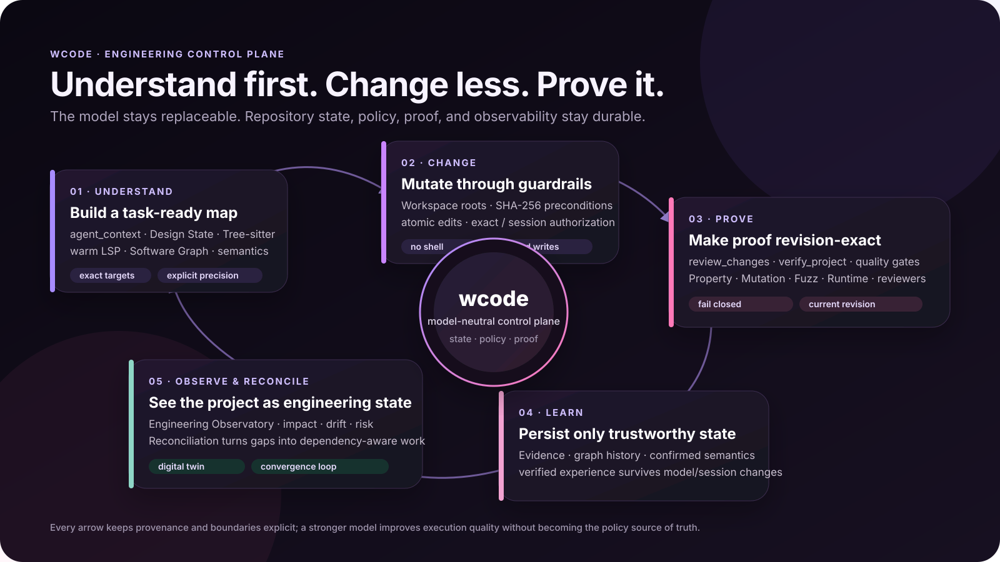
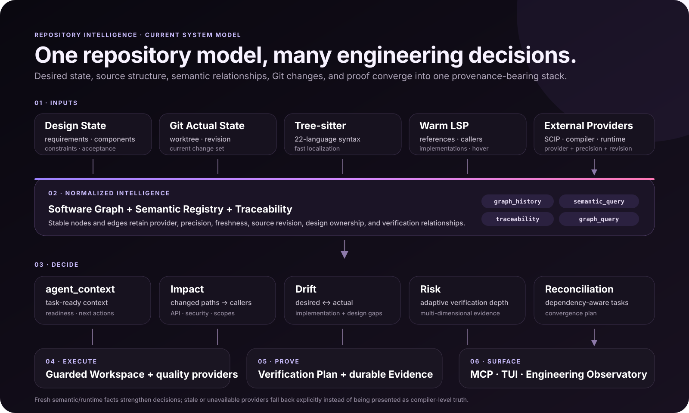
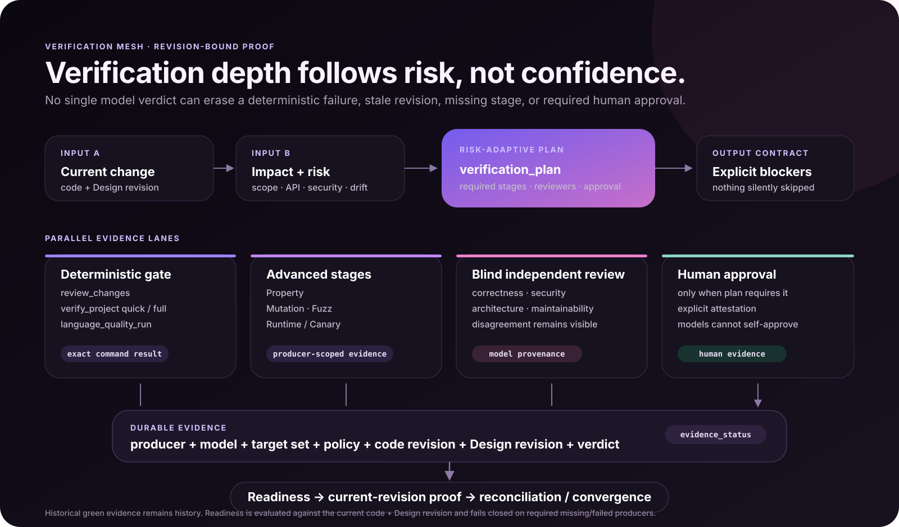
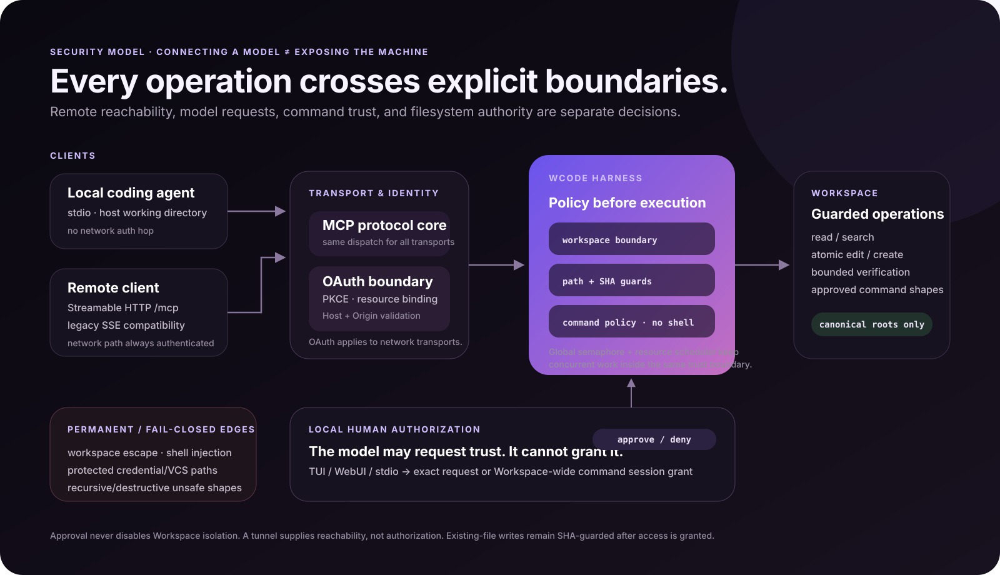

<p align="center">
  
</p>

<p align="center">
  <a href="https://github.com/francis-du/wcode/actions/workflows/release.yml"></a>
  <a href="https://github.com/francis-du/wcode/releases"></a>
  <a href="LICENSE"></a>
  <a href="https://wcode.francis.run/"></a>
</p>

# Make any coding agent understand your repo before it changes it.

**wcode is an engineering control plane for coding agents.** It gives an existing agent repository intelligence, guarded file operations, project-aware verification, durable evidence, and operator visibility through MCP.

> **Understand first. Change less. Prove it works. Learn only from proof.**

[Website](https://wcode.francis.run/) · [Documentation](https://wcode.francis.run/docs/) · [Getting started](https://wcode.francis.run/docs/getting-started/)

The website is the canonical product documentation and includes its own language switcher. The four system SVGs below are **living product documentation**: when wcode changes its engineering loop, repository model, verification contract, or security boundary, the diagrams are expected to evolve with the product.

## Get started

Install on macOS or Linux:

```bash
curl -fsSL https://raw.githubusercontent.com/francis-du/wcode/main/install.sh | sh
```

Windows PowerShell:

```powershell
irm https://raw.githubusercontent.com/francis-du/wcode/main/install.ps1 | iex
```

From the repository you want to expose:

```bash
wcode setup
```

Choose **Global (recommended)** or **Current project**, reconnect the coding agent, and let the host launch `wcode mcp-stdio`. The host working directory becomes the default Workspace.

Run the operator runtime when you also want the TUI, Engineering Observatory, Setup Hub, or remote MCP access:

```bash
wcode
```

Press **W** for the Engineering Observatory and **O** for Setup Hub. Remote clients use the public `/mcp` endpoint shown by the runtime and complete OAuth.

## The engineering loop

wcode keeps the model replaceable while repository state, policy, proof, and observability remain durable.



The loop is intentionally conservative:

- **Understand** — build task-ready context from Design State, syntax, semantics, graph relationships, conventions, and current work.
- **Change** — mutate only inside the selected Workspace with bounded writes and SHA-guarded edits.
- **Prove** — run deterministic checks, language-native quality providers, advanced verification stages, and independent review as required.
- **Learn** — retain only trustworthy, revision-bound evidence and verified repository experience.
- **Observe & reconcile** — expose architecture, changes, requirements, risk, drift, verification, and convergence state to humans and agents.

## Repository intelligence

wcode does not treat repository understanding as a large prompt dump. It builds a layered model from desired state, actual source, syntax, semantic providers, Git changes, and verification evidence.



Tree-sitter provides syntax navigation across the supported languages. Cross-file references, callers, implementations, and hover use a live LSP when available. Provider, precision, freshness, and revision stay explicit instead of being silently promoted to stronger semantics.

`agent_context` is the normal starting point for coding work. It returns bounded source, edit targets, current SHAs, checks, readiness, risks, and parallel work guidance instead of forcing every client to reconstruct the repository from scratch.

## Verification is revision-bound

Verification depth follows change risk, not model confidence.



A deterministic failure cannot be erased by a model verdict. Required advanced stages, independent reviewers, human approval, target coverage, and stale-revision blockers remain visible until they are actually satisfied.

A normal workflow is:

1. Call `agent_context` for the task.
2. Read only missing source with `read_files`, `symbol_context`, or `semantic_navigation`.
3. Apply SHA-guarded edits, batching independent work and serializing true conflicts.
4. Run `review_changes` and `verify_project`.
5. Inspect drift, impact, risk, verification state, or evidence when the task requires deeper proof.

## Security boundaries

Remote reachability, model requests, command trust, and filesystem authority are separate decisions.



Key boundaries:

- Configured Workspaces and discovered subspaces define the filesystem scope.
- Protected paths, traversal, symlink escapes, unsafe hard links, and shell injection remain blocked.
- Existing-file edits use SHA-256 preconditions and atomic commits.
- Command execution uses argument arrays without a shell.
- Authorization can stay exact per executable/operation, or the operator can explicitly authorize all otherwise-allowable commands for the selected Workspace for the current runtime session.
- TUI, protected WebUI, and stdio elicitation expose the same authorization state; the session-wide command grant can be enabled or revoked without changing Workspace boundaries.
- OAuth protects network transports; a tunnel provides reachability, not authorization.

## MCP transports

| Client location | Transport | Entry point |
| --- | --- | --- |
| Same machine | stdio | `wcode mcp-stdio` |
| Remote, preferred | Streamable HTTP | `https://host/mcp` with OAuth |
| Older remote client | SSE compatibility | `GET /sse` + `POST /message?sessionId=...` with OAuth |

Every transport reaches the same Harness, Workspace policy, authorization system, software intelligence, and verification state.

## Operator surfaces

The TUI shows runtime health, MCP state, Workspace activity, slots, throughput, verification signals, and pending authorization. The Engineering Observatory exposes the current product views: **Overview, Engineering architecture, Task activity, Verification evidence, Current changes, Requirements, and Project files**, plus Access management and Setup Hub.

Current screenshots and UI walkthroughs live on the [website product tour](https://wcode.francis.run/#product-tour) so the README does not duplicate stale interface documentation.

## Useful commands

```bash
wcode                    # start runtime + TUI
wcode setup              # configure supported coding agents
wcode update             # update an installed binary
wcode --show-config      # inspect resolved runtime settings
wcode intelligence       # inspect repository intelligence
wcode intelligence --check --json
wcode verification
wcode help-all
```

## Documentation

Use the [wcode website](https://wcode.francis.run/) as the canonical documentation entry point. It contains getting started, integrations, security, language quality, agent workflow, CLI/MCP reference, screenshots, and language switching without requiring separate README variants or version-specific documentation links.
