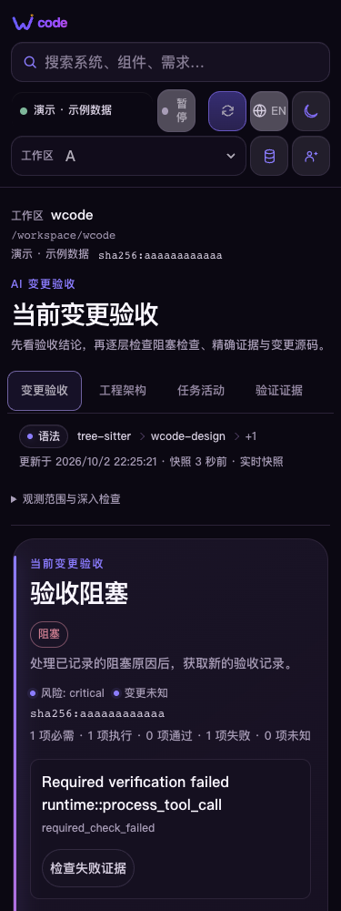
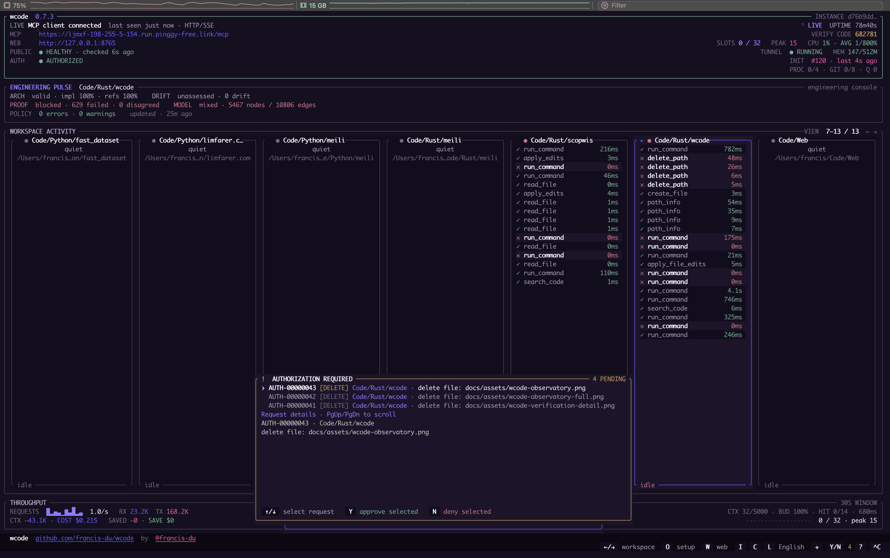
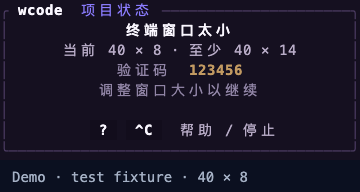

# Workbench UI review

The workbench keeps the current workspace, source revision and snapshot state visible across all seven pages. Navigation remembers the last supported page; unavailable local storage and invalid preferences fall back safely. The current page heading and browser title follow language and workspace changes. Keyboard users can skip directly to the active page or return to acceptance from the brand link.

Observation coverage remains available in a native disclosure. This gives the acceptance decision, task list, source inspection or requirement detail space before supporting coverage on a phone. Existing source precision, stale snapshots, failed evidence and operator permissions keep their original meanings.

| Surface | Main states retained | Verification |
| --- | --- | --- |
| Acceptance | blocked, missing checks, stale evidence, exact evidence navigation | production DOM fixtures and native tests |
| Architecture | system map, components, dependencies, code graph, source inspector, full screen | production DOM geometry fixtures |
| Activity | running, queued, unavailable, worker ownership, task results | production renderer behavior and geometry fixtures |
| Check results | current failure, history, unavailable verification, evidence selection | production renderer behavior and geometry fixtures |
| Current changes | unavailable review, working/index/HEAD comparisons, escaped source | production renderer behavior and geometry fixtures |
| Requirements | filtered selection, traceability and impact | production renderer behavior and geometry fixtures |
| Project files | partial source coverage, searchable file tree, large files, source navigation | production renderer behavior and geometry fixtures |
| Public setup | local connection, verified/unavailable endpoint, optional launch settings, copy success/manual selection | setup behavior harness and browser DOM checks |
| TUI | wide/compact dashboard, tiny-window recovery, help, authorization, command/workspace overlays | production `draw_dashboard` matrix across 22 states plus monitor behavior tests |

The tiny-window TUI reserves a final row for help and stop before laying out explanatory text. It shows the current dimensions and the actual minimum height computed by the dashboard, including setup and tunnel rows. The renderer lives in a separate module so the shell stays below its source-size boundary. Runtime dispatch and authorization actions are unchanged.

Local review used the production HTML/CSS/JavaScript with explicit fixture data. Chrome 154 covered 140 page/language/theme/viewport combinations and keyboard tab, skip and home interactions. Native WebKit covered 256 cases, including architecture subviews and source inspectors. Public setup covered 20 browser combinations; clipboard delivery was mocked while feedback and manual selection used the real DOM. The complete production `draw_dashboard` renderer exports 22 frames across wide, compact, tiny, help, command, project-detail, Full Access, workspace-input, command authorization, human decision and operation-feedback states in English and Chinese. The compact renderer additionally covers 32 terminal-size/language combinations; the old renderer fails the same recovery-key negative control.

These fixtures verify presentation and browser behavior. They do not establish live provider, OAuth, tunnel or backend acceptance. The complete native integration suite and cross-platform builds must pass the pull request CI; the isolated compact renderer is supplementary evidence.

## Current interface images

These images come from the production browser bundle and production Ratatui renderer with explicit test fixture data. Connection state, tasks, requirements and approval requests are demonstrations. No provider connection, permission grant or acceptance action was executed to create them.

| Page | Desktop image |
| --- | --- |
| Acceptance | [Current workspace and acceptance](assets/wcode-overview.png) |
| Architecture | [Architecture and source relationships](assets/wcode-architecture.png) |
| Activity | [Current task activity](assets/wcode-task-activity.png) |
| Check results | [Verification and evidence](assets/wcode-verification-evidence.png) |
| Current changes | [Change review](assets/wcode-current-changes.png) |
| Requirements | [Requirement detail and traceability](assets/wcode-requirements.png) |
| Project files | [Project file inspection](assets/wcode-project-files.png) |
| Access | [Workspace and operation access](assets/wcode-access-management.png) |
| Setup | [Connection guide and command feedback](assets/wcode-setup-hub.png) |

## Terminal state review

The fixture test calls the complete production dashboard renderer, preserves its cell colors and wide-character positions, and exports its buffer to SVG. Chrome converts that SVG to the images below. This checks rendered states; it does not prove terminal-emulator input dispatch, runtime shutdown or a live backend. Existing native behavior tests retain those separate contracts. CI uploads the 22 original SVG frames and their manifest for each platform.

| Surface | English | Chinese |
| --- | --- | --- |
| Wide | [Frame](assets/tui/wide-en.png) | [界面](assets/tui/wide-zh-CN.png) |
| Compact | [Frame](assets/tui/compact-en.png) | [界面](assets/tui/compact-zh-CN.png) |
| Tiny | [Frame](assets/tui/tiny-en.png) | [界面](assets/tui/tiny-zh-CN.png) |
| Help | [Frame](assets/tui/help-en.png) | [界面](assets/tui/help-zh-CN.png) |
| Commands | [Frame](assets/tui/commands-en.png) | [界面](assets/tui/commands-zh-CN.png) |
| Project Details | [Frame](assets/tui/project-details-en.png) | [界面](assets/tui/project-details-zh-CN.png) |
| Full Access | [Frame](assets/tui/full-access-en.png) | [界面](assets/tui/full-access-zh-CN.png) |
| Workspace Input | [Frame](assets/tui/workspace-input-en.png) | [界面](assets/tui/workspace-input-zh-CN.png) |
| Command Authorization | [Frame](assets/tui/command-authorization-en.png) | [界面](assets/tui/command-authorization-zh-CN.png) |
| Human Decision | [Frame](assets/tui/human-decision-en.png) | [界面](assets/tui/human-decision-zh-CN.png) |
| Operation Feedback | [Frame](assets/tui/operation-feedback-en.png) | [界面](assets/tui/operation-feedback-zh-CN.png) |

Reproduce the terminal artifacts with `cargo test --locked --lib production_dashboard_render_review_exports_all_operator_surfaces`. Browser fixtures use `node tests/unit/ui/browser.cjs .`; the fixture marker remains visible in published images.
